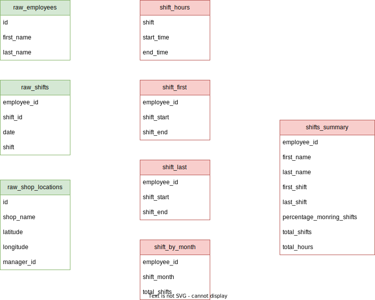

# Sample TBD Project

Welcome to TBD's example/sample repository! This repository is aimed at getting you started by showing you some of the basic features. 

The project illustrates some simple data of a shop with a few stores and with individuals working shifts in them. The following tables illustrate the relationship between seeds, models and sources. For more information about these visit the [docs](https://tobedetermined.io/docs).

## Data Model

The example is based upon the following data model, where the green tables are seeds and the red tables are models.



## Visual Studio Code Run Through

This example takes you down the path of using the Visual Studio Code extension, but it can be equally done with a CLI tool.

In this demonstration, you will: 

1. Clone the repository
2. Opening the project and installing the extension
3. Run the models and tests
4. Render the tables and views
5. Quickly render a model
6. Add a separate table to the database and a and source to the project

### Cloning the repository

This repository is a template, so use the `Use this template` button to create button to clone it. 

### Opening the project and installing the extension

Once you have cloned the repository you can open in a in-browser instance of VS Code. You can do this by using the period shortcut `.`.

This should open a VS Code instance in your browser at `github.dev/<your-username>/<project-name>`.

Once there, you can install the extension by either: 

- Clicking the `Install` button in the bottom right corner, when VS Code asks you to install recommended extensions
- Clicking on the extensions icon and installing the extensions from there in the `Recommended` tab

### Running the models and tests

Once you have the extension installed, you can run the models and tests by using the command palette which can be opened with `Cmd + Shift + P` or `Ctrl + Shift + P`. The commands are:

- `TBD: Run` to run all the models
- `TBD: Test` to run all the tests

Note:

- When running TBD for the first time, VSCode will ask you which database configuration to use, for this demo use `sqlite-in-browser`.
- For the tests to run successfully, you need to run the models first to put them in the database first.

### Render the tables and views

Showing the tables and views in the database can be done with the `TBD: Render Tables` commands. 

### Quickly render a model

When developing it is useful to be able to quickly render models, for this use the `TBD: Render Model` command. This will prompt you with the model you wish to render and then render the chosen model. 

### Add a separate table to the database and a and source to the project

To add a table, use the `TBD: Statement` command which allows arbitrary SQL statements to be run against the database

```sql
CREATE TABLE IF NOT EXISTS employee_band_table (employee_id INTEGER, band_id INTEGER);
```

To add a source, create a new project file and add the following definition to it

```yaml
sources: 
  - name: employee_band
    path: employee_band_table
```

This source can now be used in models and tests.